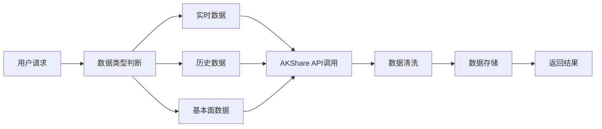

# AkShare工具集成设计文档

## 概述
AKShare是一个功能强大的Python金融数据获取库，为股票分析系统提供全面的数据支持。本文档详细设计如何将AKShare集成到股票知识分析系统中。

## AKShare核心数据源
### 主要数据提供商
- 东方财富 (East Money)
- 新浪财经 (Sina Finance)
- 腾讯财经 (Tencent Finance)
- 雪球 (Xueqiu)
- 同花顺 (Tonghuashun)

## 数据获取模块设计

### 1. 实时行情数据
```python
import akshare as ak
import pandas as pd
import logging
from typing import Optional, Dict, Any

class RealTimeDataService:
    """实时行情数据服务"""

    def get_a_share_spot(self):
        """获取A股实时行情"""
        return ak.stock_zh_a_spot_em()

    def get_stock_realtime(self, symbol: str):
        """获取单只股票实时数据"""
        return ak.stock_zh_a_spot_em()

    def get_market_indices(self):
        """获取主要指数实时数据"""
        return ak.stock_zh_index_spot_em()
```

### 2. 历史价格数据
```python
import akshare as ak
import pandas as pd
from typing import Optional
from datetime import datetime, timedelta

class HistoricalDataService:
    """历史数据服务"""

    def get_historical_prices(self, symbol: str, start_date: str,
                             end_date: str, adjust: str = "qfq"):
        """
        获取历史价格数据
        adjust: 'qfq'前复权, 'hfq'后复权, ''不复权
        """
        return ak.stock_zh_a_hist(
            symbol=symbol,
            start_date=start_date,
            end_date=end_date,
            adjust=adjust
        )

    def get_minute_data(self, symbol: str, period: str = "1"):
        """获取分钟级数据"""
        return ak.stock_zh_a_hist_min_em(
            symbol=symbol,
            period=period  # "1", "5", "15", "30", "60"
        )
```

### 3. 基本面数据
```python
import akshare as ak
import pandas as pd
from typing import Optional, Dict, Any

class FundamentalDataService:
    """基本面数据服务"""

    def get_financial_summary(self, symbol: str):
        """获取财务摘要"""
        return ak.stock_financial_abstract(stock=symbol)

    def get_balance_sheet(self, symbol: str):
        """获取资产负债表"""
        return ak.stock_balance_sheet_by_report_em(symbol=symbol)

    def get_income_statement(self, symbol: str):
        """获取利润表"""
        return ak.stock_profit_sheet_by_report_em(symbol=symbol)

    def get_cash_flow(self, symbol: str):
        """获取现金流量表"""
        return ak.stock_cash_flow_sheet_by_report_em(symbol=symbol)
```

### 4. 市场数据分析
```python
import akshare as ak
import pandas as pd
from typing import Optional, Dict, Any

class MarketAnalysisService:
    """市场分析数据服务"""

    def get_turnover_rate(self, symbol: str):
        """获取换手率数据"""
        return ak.stock_zh_a_hist(symbol=symbol)['换手率']

    def get_volume_analysis(self, symbol: str):
        """获取成交量分析"""
        return ak.stock_zh_a_hist(symbol=symbol)['成交量']

    def get_money_flow(self, symbol: str):
        """获取资金流向"""
        return ak.stock_individual_fund_flow(stock=symbol)
```

## 数据处理工作流

### 数据获取流程


### 数据缓存策略
```python
import redis
import json
import logging
from typing import Optional, Dict, Any

class DataCacheManager:
    """数据缓存管理"""

    def __init__(self):
        self.redis_client = redis.Redis()
        self.cache_config = {
            'realtime': 30,      # 实时数据缓存30秒
            'daily': 3600,       # 日线数据缓存1小时
            'fundamental': 86400  # 基本面数据缓存1天
        }

    def get_cached_data(self, key: str, data_type: str):
        """获取缓存数据"""
        cached = self.redis_client.get(key)
        if cached:
            return json.loads(cached)
        return None

    def cache_data(self, key: str, data: dict, data_type: str):
        """缓存数据"""
        expire_time = self.cache_config.get(data_type, 300)
        self.redis_client.setex(
            key,
            expire_time,
            json.dumps(data, ensure_ascii=False)
        )
```

## 错误处理与重试机制

### 异常处理策略
```python
import time
from functools import wraps

def retry_on_failure(max_retries=3, delay=1):
    """重试装饰器"""
    def decorator(func):
        @wraps(func)
        def wrapper(*args, **kwargs):
            for attempt in range(max_retries):
                try:
                    return func(*args, **kwargs)
                except Exception as e:
                    if attempt == max_retries - 1:
                        raise e
                    time.sleep(delay * (2 ** attempt))  # 指数退避
            return None
        return wrapper
    return decorator

class AKShareDataProvider:
    """AKShare数据提供者"""

    @retry_on_failure(max_retries=3)
    def fetch_data(self, func, *args, **kwargs):
        """安全的数据获取方法"""
        try:
            return func(*args, **kwargs)
        except Exception as e:
            logger.error(f"数据获取失败: {str(e)}")
            raise
```

## 数据质量控制

### 数据验证规则
```python
class DataValidator:
    """数据验证器"""

    def validate_stock_data(self, data: pd.DataFrame) -> bool:
        """验证股票数据质量"""
        checks = [
            self._check_required_columns(data),
            self._check_data_types(data),
            self._check_value_ranges(data),
            self._check_missing_values(data)
        ]
        return all(checks)

    def _check_required_columns(self, data: pd.DataFrame) -> bool:
        """检查必需列"""
        required = ['开盘', '收盘', '最高', '最低', '成交量']
        return all(col in data.columns for col in required)

    def _check_value_ranges(self, data: pd.DataFrame) -> bool:
        """检查数值范围合理性"""
        return (
            (data['成交量'] >= 0).all() and
            (data['最高'] >= data['最低']).all() and
            (data['收盘'] > 0).all()
        )
```

## 性能优化策略

### 1. 批量数据获取
```python
import concurrent.futures
import logging
from typing import List, Dict
import pandas as pd

logger = logging.getLogger(__name__)

class BatchDataService:
    """批量数据服务"""

    def get_multiple_stocks(self, symbols: List[str]) -> Dict[str, pd.DataFrame]:
        """批量获取多只股票数据"""
        results = {}
        with concurrent.futures.ThreadPoolExecutor(max_workers=5) as executor:
            future_to_symbol = {
                executor.submit(self._get_single_stock, symbol): symbol
                for symbol in symbols
            }

            for future in concurrent.futures.as_completed(future_to_symbol):
                symbol = future_to_symbol[future]
                try:
                    results[symbol] = future.result()
                except Exception as e:
                    logger.error(f"获取{symbol}数据失败: {e}")

        return results
```

### 2. 数据压缩存储
```python
import pandas as pd
import os
from pathlib import Path

class DataStorage:
    """数据存储管理"""

    def store_historical_data(self, symbol: str, data: pd.DataFrame):
        """存储历史数据（压缩格式）"""
        file_path = f"data/{symbol}_hist.parquet"
        data.to_parquet(file_path, compression='snappy')

    def load_historical_data(self, symbol: str) -> pd.DataFrame:
        """加载历史数据"""
        file_path = f"data/{symbol}_hist.parquet"
        return pd.read_parquet(file_path)
```

## API限制与配额管理

### 请求频率控制
```python
from ratelimit import limits, sleep_and_retry

class RateLimitedAPI:
    """限流API调用"""

    @sleep_and_retry
    @limits(calls=100, period=60)  # 每分钟100次请求
    def call_akshare_api(self, func, *args, **kwargs):
        """限流的AKShare API调用"""
        return func(*args, **kwargs)
```

## 集成到股票分析系统

### 系统架构整合
```python
class StockAnalysisSystem:
    """股票分析系统主类"""

    def __init__(self):
        self.realtime_service = RealTimeDataService()
        self.historical_service = HistoricalDataService()
        self.fundamental_service = FundamentalDataService()
        self.cache_manager = DataCacheManager()
        self.validator = DataValidator()

    def analyze_stock(self, symbol: str) -> Dict:
        """综合股票分析"""
        # 获取实时数据
        realtime = self.realtime_service.get_stock_realtime(symbol)

        # 获取历史数据
        historical = self.historical_service.get_historical_prices(
            symbol, "20230101", "20241201"
        )

        # 获取基本面数据
        fundamental = self.fundamental_service.get_financial_summary(symbol)

        # 数据验证
        if not self.validator.validate_stock_data(historical):
            raise ValueError("数据质量检查失败")

        # 综合分析
        analysis_result = {
            'basic_info': realtime,
            'price_trend': self._analyze_price_trend(historical),
            'fundamental_score': self._calculate_fundamental_score(fundamental),
            'risk_assessment': self._assess_risk(historical),
            'recommendation': self._generate_recommendation(historical, fundamental)
        }

        return analysis_result
```

## 监控与日志

### 数据获取监控
```python
import logging
from datetime import datetime

class AKShareMonitor:
    """AKShare数据获取监控"""

    def __init__(self):
        self.logger = self._setup_logger()
        self.metrics = {
            'api_calls': 0,
            'success_rate': 0,
            'average_response_time': 0
        }

    def log_api_call(self, func_name: str, success: bool, response_time: float):
        """记录API调用"""
        self.metrics['api_calls'] += 1

        log_data = {
            'timestamp': datetime.now().isoformat(),
            'function': func_name,
            'success': success,
            'response_time': response_time
        }

        if success:
            self.logger.info(f"API调用成功: {log_data}")
        else:
            self.logger.error(f"API调用失败: {log_data}")
```

## 部署配置

### 配置文件示例
```yaml
# akshare_config.yaml
akshare:
  data_sources:
    primary: "east_money"
    fallback: ["sina", "tencent"]

  cache:
    redis_host: "localhost"
    redis_port: 6379
    default_expire: 300

  rate_limits:
    calls_per_minute: 100
    calls_per_hour: 1000

  retry:
    max_attempts: 3
    backoff_factor: 2

  storage:
    data_path: "./data"
    compression: "snappy"
    format: "parquet"
```

## 总结

本设计文档提供了将AKShare库集成到股票分析系统的完整方案，包括：

1. **数据获取**: 实时行情、历史数据、基本面数据
2. **性能优化**: 缓存机制、批量处理、数据压缩
3. **质量控制**: 数据验证、错误处理、重试机制
4. **系统集成**: API设计、监控日志、部署配置

通过这个设计，系统可以高效、稳定地获取和处理股票数据，为投资分析提供可靠的数据基础。

## 环境配置

### .env文件配置
工具的所有默认配置必须写入到.env文件中：

```bash
# .env 文件示例

# Redis缓存配置
REDIS_HOST=localhost
REDIS_PORT=6379
REDIS_PASSWORD=
REDIS_DB=0

# 数据缓存时间配置（秒）
CACHE_REALTIME_EXPIRE=30
CACHE_DAILY_EXPIRE=3600
CACHE_FUNDAMENTAL_EXPIRE=86400

# API限流配置
API_RATE_LIMIT_CALLS=100
API_RATE_LIMIT_PERIOD=60
API_MAX_RETRIES=3
API_RETRY_DELAY=1

# 数据存储配置
DATA_STORAGE_PATH=./data
DATA_COMPRESSION=snappy
DATA_FORMAT=parquet

# 日志配置
LOG_LEVEL=INFO
LOG_FILE_PATH=./logs/akshare.log
LOG_MAX_SIZE=10485760
LOG_BACKUP_COUNT=5

# 数据质量检查配置
DATA_VALIDATION_ENABLED=true
DATA_MISSING_THRESHOLD=0.1
DATA_OUTLIER_DETECTION=true

# 批处理配置
BATCH_MAX_WORKERS=5
BATCH_TIMEOUT=300

# AkShare数据源优先级
AKSHARE_PRIMARY_SOURCE=east_money
AKSHARE_FALLBACK_SOURCES=sina,tencent

# 监控配置
MONITORING_ENABLED=true
METRICS_EXPORT_INTERVAL=60
```

### Python配置类
```python
import os
from dataclasses import dataclass
from typing import List

@dataclass
class AkShareConfig:
    """AkShare工具配置类"""

    # Redis配置
    redis_host: str = os.getenv('REDIS_HOST', 'localhost')
    redis_port: int = int(os.getenv('REDIS_PORT', 6379))
    redis_password: str = os.getenv('REDIS_PASSWORD', '')
    redis_db: int = int(os.getenv('REDIS_DB', 0))

    # 缓存配置
    cache_realtime_expire: int = int(os.getenv('CACHE_REALTIME_EXPIRE', 30))
    cache_daily_expire: int = int(os.getenv('CACHE_DAILY_EXPIRE', 3600))
    cache_fundamental_expire: int = int(os.getenv('CACHE_FUNDAMENTAL_EXPIRE', 86400))

    # API限流配置
    api_rate_limit_calls: int = int(os.getenv('API_RATE_LIMIT_CALLS', 100))
    api_rate_limit_period: int = int(os.getenv('API_RATE_LIMIT_PERIOD', 60))
    api_max_retries: int = int(os.getenv('API_MAX_RETRIES', 3))
    api_retry_delay: int = int(os.getenv('API_RETRY_DELAY', 1))

    # 数据存储配置
    data_storage_path: str = os.getenv('DATA_STORAGE_PATH', './data')
    data_compression: str = os.getenv('DATA_COMPRESSION', 'snappy')
    data_format: str = os.getenv('DATA_FORMAT', 'parquet')

    # 日志配置
    log_level: str = os.getenv('LOG_LEVEL', 'INFO')
    log_file_path: str = os.getenv('LOG_FILE_PATH', './logs/akshare.log')

    # 数据质量检查
    data_validation_enabled: bool = os.getenv('DATA_VALIDATION_ENABLED', 'true').lower() == 'true'
    data_missing_threshold: float = float(os.getenv('DATA_MISSING_THRESHOLD', 0.1))

    # 批处理配置
    batch_max_workers: int = int(os.getenv('BATCH_MAX_WORKERS', 5))
    batch_timeout: int = int(os.getenv('BATCH_TIMEOUT', 300))

    @classmethod
    def load_config(cls) -> 'AkShareConfig':
        """从环境变量加载配置"""
        return cls()
```

## 注意事项

1. **环境变量优先级**: 环境变量配置优先于代码中的默认值
2. **敏感信息安全**: Redis密码等敏感信息必须通过环境变量配置，不得硬编码
3. **配置验证**: 系统启动时应验证所有必要的配置项
4. **配置热更新**: 部分配置（如缓存时间）支持运行时更新
5. **生产环境配置**: 生产环境必须设置适当的限流和超时配置